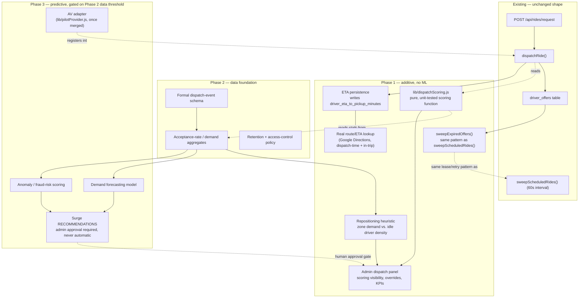

# Harvey Taxi — AI Dispatch Commander: Audit & Phased Architecture

Status: **proposal — not approved, no implementation started**
Scope: intelligent dispatch (driver matching, repositioning, route
optimization, live ETA) now, with an explicit path to demand
forecasting, fraud-risk scoring, and admin-approved surge
recommendations later — unified across taxi rides, food delivery,
grocery delivery, HTAF transportation, and future autonomous vehicles.

This document does not add or change any code, schema, or deployment
configuration. Per instruction, nothing here ships until you approve
it — Section 9 lists every decision that needs your sign-off before
Phase 1 work starts.

**Source of the audit below**: a full code-level pass over the current
working tree (branch `hotfix/rider-dashboard-rider-id-hydration` = `main`
plus one small hotfix), citing exact `file:line` for every claim. One
scope note up front: **Autonomous Pilot (`lib/pilotProvider.js`,
`lib/pilotLifecycle.js`, `/api/autonomous-pilot/*`) exists only on the
separate, unmerged branch `claude/ai-agents-upgrade-rvgfyh`** — it is not
in `main` today. Section 1.8 and Phase 3's AV hook are written against
that branch's code and flagged as a dependency, not as something already
live.

---

## 1. Current-State Dispatch Audit

### 1.1 Dispatch flow

All four request types — standard ride, food, grocery, HTAF — share one
path: `POST /api/rides/request` (`server.js:8955`) inserts one `rides`
row (`ride_type` discriminates: `standard`/`airport`/`medical`, `food`,
`grocery`, `foundation`), then calls `shouldDispatchRideNow()`
(`lib/rideDispatch.js:25-42`) and, if true, `dispatchRide()`
(`server.js:8045-8351`) immediately.

`dispatchRide()`:
1. Checks the `dispatch_paused` flag (`server.js:8053-8087`).
2. Builds an exclude-list from every prior `driver_offers` row for this
   ride, any status (`server.js:8099-8127`).
3. Calls `findAvailableDrivers({ pickup_lat, pickup_lng, exclude_driver_ids })`
   (`server.js:7729-7961`).
4. **Takes `drivers[0]`** — the single nearest candidate
   (`server.js:8181-8183`).
5. Creates the offer via an atomic RPC if available, else a two-step
   fallback (`server.js:8199-8331`).

`findAvailableDrivers()` prefers a PostGIS RPC (`nearest_drivers`,
`server.js:7777-7787`) but — **no migration in this repo defines that
RPC**, so the active path is almost certainly the in-Node fallback:
query `drivers` where `online = true`, `status = active`,
`approval_status = approved` (`server.js:7843-7853`), compute Haversine
distance per driver, filter to radius, and **sort by ascending distance
only** (`server.js:7947-7955`). Candidate pool is capped at
`MAX_DISPATCH_ATTEMPTS` (env, default 5).

**Confirmed as-built**: distance is the only ranking signal. No rating,
acceptance-history, or service-type weighting exists anywhere in
dispatch today, even though `drivers.rating`, `drivers.total_trips`,
`drivers.supports_food_delivery`, and `drivers.supports_grocery_delivery`
all exist as columns — **none of the four are read by `findAvailableDrivers()`**.
A driver who's never delivered groceries can be offered a grocery run.

### 1.2 Offer expiration and redispatch

`DISPATCH_TIMEOUT_SECONDS` (env, default **30s**) sets `expires_at` at
offer creation (`server.js:7999-8005`) — **and nothing ever reads or
enforces it again.** Grepping the full repo for `expires_at` finds only
the write site plus unrelated OTP-token code. There is no sweep, cron,
or check that marks an offer `expired`.

Redispatch as actually implemented is **decline-triggered, not
timeout-triggered**: `POST /api/driver/offers/:offerId/decline`
(`server.js:10861-10975`) marks the offer declined and, if
`ENABLE_AUTO_REDISPATCH` (default on), calls `dispatchRide()` again up
to `MAX_DISPATCH_ATTEMPTS` times (`server.js:11001-11054`).

**Real gap**: a driver who neither accepts nor declines leaves the ride
stuck in `dispatch_status: "offer_sent"` indefinitely. The driver
dashboard has no polling route wired to learn of a pending offer at all
— the only channel is the push notification fired at dispatch time
(`server.js:12224-12229`). If that notification is missed, the rider
waits forever with no automatic recovery.

### 1.3 Driver GPS and ETA

`POST /api/driver/location` (`server.js:12386-12534`) is rate-limited to
one update per 5 seconds per driver, requires an active ride, and
persists `current_lat/lng`, `heading`, `speed`, `location_accuracy_meters`,
`last_seen_at` to the `drivers` row (`server.js:12484-12506`), broadcasting
a `location` SSE event to the ride's live stream.

`haversineMiles()` (`server.js:2823-2861`) plus `ASSUMED_DELIVERY_SPEED_MPH`
(env, default **22 mph**) compute an ETA **transiently, on each
`GET /api/rides/:id/status` poll** (`server.js:9976-9998`) — never
persisted.

**Real gap, and an important one**: `rides.driver_eta_to_pickup_minutes`
and `rides.driver_distance_to_pickup_miles` are selected and returned in
three separate routes (`server.js:9864, 10456, 13631`) but **grepping the
entire codebase for a write to either column returns zero matches.**
These fields are read-only from the app's own perspective. The
`avg_wait_minutes` aggregate on the admin operations-overview dashboard
(`server.js:13657-13661`) is built on a column that is always empty in
practice. **"Live ETA recalculation" is not a new feature to build — it's
closing an existing, silent gap.**

The ride-scoped SSE stream (`GET /api/rides/:id/stream`,
`server.js:13091-13141`) has no auth beyond ride existence, emits a
`connected` event, then a `heartbeat` every 25s, plus event-driven
`location`/`stage` pushes.

### 1.4 Status state machine

`RIDE_STATUS` (`lib/rideDispatch.js:6-18`): `draft`, `payment_required`,
`payment_authorized`, `awaiting_driver_acceptance`, `driver_assigned`,
`driver_enroute`, `arrived`, `in_progress`, `completed`, `cancelled`,
`failed`.

`DELIVERY_STAGE` (`server.js:1426-1444`, food/grocery only):
`order_accepted → enroute_store → arrived_store → waiting_for_order →
picked_up → enroute_customer → arrived_customer → delivered`.

**Real gap**: `RIDE_STATUS.CANCELLED` is defined and referenced in
rider-history filtering (`server.js:10162`) but **no route in this
codebase ever sets a ride to `cancelled`** — there is no cancel endpoint
at all today. Out of explicit scope for this plan, but worth flagging
since a dispatch commander optimizing "unmet demand" needs to distinguish
a completed ride from one that silently never resolved.

### 1.5 Pricing engine

`lib/pricing.js`, one function, `calculateRideEstimate()`, used by every
service. Flat-rate model: base fare + per-mile + per-minute for
passenger rides; flat delivery fee + per-mile (no time charge) for
food/grocery; a flat 5% discount for `medical`/`foundation`; a flat $5
surcharge for `airport`. **The airport surcharge is the only
dynamic-adjustment-like concept anywhere in pricing, and it's a fixed
constant** — there is no surge/multiplier concept, not even a disabled
placeholder, and no time-of-day or demand-based adjustment of any kind.

### 1.6 Event/audit logging

`auditLog()` (`server.js:2304-2400`) writes to `audit_logs`
(`actor_type, actor_id, action, entity_type, entity_id, metadata, ip,
user_agent, created_at`), best-effort/fire-and-forget.

**Genuinely useful existing data for a future model**: `ride_estimate_created`
audit rows log the full itemized fare object as `metadata`
(`server.js:8488-8506`) for *every quote requested*, whether or not it
converts — real, structured demand signal already being captured today,
just never aggregated. `rides.pricing_snapshot` persists the same
breakdown on the ride itself (`server.js:9209-9211`). `driver_offers`
rows carry `attempt`, `created_at`, `responded_at` — raw material for
acceptance-latency/decline-rate analysis, but **nothing currently
aggregates it into a stat anywhere.**

**Confirmed absent**: no dedicated telemetry table, no HTTP/dispatch
latency instrumentation, no per-driver acceptance-rate column, no
snapshot of *why* a given driver was chosen on any `driver_offers` row
(no rank, no distance-at-offer-time).

### 1.7 HTAF dispatch

HTAF rides use the **exact same `rides` table and `dispatchRide()`
pipeline** as everything else, tagged `ride_type: "foundation"`. Created
by an admin manually via `POST /api/admin/foundation/applications/:id/create-ride`
(`server.js:14872-15062`) after application approval — not automatic.
Same `findAvailableDrivers()`, same `driver_offers` table, same
offer/accept/decline flow, same driver pool. No separate HTAF dispatch
mechanism exists.

### 1.8 Autonomous Pilot's existing seams *(unmerged branch only)*

On `claude/ai-agents-upgrade-rvgfyh`: `lib/pilotProvider.js` defines a
six-method adapter contract (`checkAvailability`, `reserveVehicle`,
`cancelReservation`, `getVehicleStatus`, `getVehicleLocation`,
`requestRemoteAssistance`) with one honest placeholder implementation
(`manualOperationsAdapter`, everything returns `simulated: true`, never
fabricates data). `lib/pilotLifecycle.js` is a pure state machine kept
deliberately separate from `RIDE_STATUS`, with `canEnterHumanDispatch(ride)`
as the literal gate that keeps autonomous rides out of the normal
human-driver offer pool unless explicitly released to it.

This is exactly the seam a future AV integration for Dispatch Commander
would use: register a new adapter, no changes needed to `dispatchRide()`
itself. **Dependency for Phase 3**: this branch needs to be merged to
`main` before any AV-dispatch work can build on it for real.

### 1.9 Feature-flag pattern

`getSystemFlag(key, fallback)` (`server.js:17145-17175`) — fail-safe,
string-valued, already gates `dispatch_paused` and `rider_history_enabled`.
This is the mechanism every new capability below should use for
incremental, reversible rollout — no new flag system needed.

### 1.10 Scheduled-dispatch sweep (the one fully-complete piece)

`sweepScheduledRides()` (`lib/rideDispatch.js:71-141`), run via
`setInterval` every **60 seconds** from server boot
(`server.js:18736-18748`). Claims due rides atomically, dispatches them,
and — this is the part worth modeling elsewhere — **resets a ride for
immediate retry on the very next tick if `dispatchRide()` itself throws**,
plus recovers from a claim that went stale because the process died
mid-dispatch (5-minute lease, `lib/rideDispatch.js:48`). This
retry/lease/reset pattern is exactly what Phase 1's offer-expiry fix
(1.2) should reuse rather than inventing a new mechanism.

---

## 2. Capability & Data-Gap Matrix

| Capability | Exists today | Data available now | Gap |
|---|---|---|---|
| Distance-based candidate lookup | Yes (nearest-only) | Yes | No scoring beyond distance |
| Driver-to-request scoring (rating/history/service-type) | No | Partial — `rating`, `total_trips`, `supports_*` columns exist but unused; no acceptance-rate stat exists | Build scoring function + a lightweight rolling acceptance stat |
| Offer timeout enforcement | Written, never enforced | `expires_at` exists | Build the sweep that actually marks/redispatches on timeout |
| Live ETA to pickup | Computed transiently, never persisted | `driver_eta_to_pickup_minutes`/`driver_distance_to_pickup_miles` columns exist, unwritten | Write these columns on offer + on each location ping |
| Real route-based ETA/distance | No — straight-line Haversine only | Google Maps API already used client-side elsewhere in the app | Add a route/ETA API call for dispatch-time and in-trip ETA |
| Repositioning recommendations | No | Ride-request audit logs + driver location already captured | Build a zone-demand heuristic + admin surfacing |
| Route/multi-stop optimization | N/A — every ride is single pickup→dropoff | N/A | Out of scope until multi-stop rides exist |
| Dispatcher override / rollback control | No dedicated UI; `dispatch_paused` flag exists as a blunt global switch | — | Add per-capability flags + an admin view of scoring decisions |
| Cancellation | Status value defined, never reachable | — | Out of explicit scope, but a real hole — see §9 |
| Event schema for demand modeling | Partially — `ride_estimate_created` audit rows are real demand signal | Yes, uncollected/unaggregated | Phase 2: formalize and aggregate |
| Fraud/anomaly signal | None | `driver_offers` timestamps, `audit_logs` are a starting point | Phase 2/3 |
| Surge / dynamic pricing | None — pricing is 100% static except two fixed constants | — | Phase 3, recommendation-only, admin-approved, never automatic |
| AV/autonomous dispatch hook | Exists on unmerged branch only | — | Merge branch first; then register as a `PROVIDERS` adapter |

---

## 3. Proposed Architecture

Every Phase 1 box is additive to `dispatchRide()`, not a replacement —
`findAvailableDrivers()` still returns a candidate pool; scoring re-ranks
that pool instead of taking `drivers[0]` unconditionally. The existing
accept/decline/redispatch mechanics don't change shape.

---

## 4. Database & API Impacts

All additive. Nothing existing is restructured or renamed.

### 4.1 Schema (Phase 1)

- `driver_offers` gains `distance_miles`, `eta_minutes`, `score`, `rank`
  (numeric, nullable) — a snapshot of *why* a driver was chosen, written
  at offer-creation time. This is what makes scoring auditable and
  reversible rather than a black box.
- A new small table, `driver_dispatch_stats` (`driver_id`, `service_type`,
  `offers_total`, `offers_accepted`, `offers_declined`,
  `offers_timed_out`, `window_start`, `updated_at`) — a rolling, non-ML
  acceptance-rate stat per driver per service type. Kept separate from
  `drivers` itself so high-frequency updates don't contend with the row
  every other query reads.
- A new small table, `dispatch_repositioning_suggestions` (`id`,
  `driver_id`, `suggested_lat`, `suggested_lng`, `zone_label`, `reason`,
  `created_at`, `dismissed_at`, `accepted_at`) — dispatcher-facing,
  supports the explicit "human override" and "measurable KPI" requirement.
- `rides.driver_eta_to_pickup_minutes` / `driver_distance_to_pickup_miles`
  — **no schema change**, these columns already exist; Phase 1 just
  starts writing them.
- New `system_flags` rows: `dispatch_scoring_enabled`,
  `dispatch_scoring_shadow_mode`, `dispatch_repositioning_enabled`,
  `dispatch_route_api_enabled` — each independently toggleable and
  instantly rollback-able without a deploy, per the existing pattern.

### 4.2 Schema (Phase 2)

- Formalized event schema — likely a `dispatch_events` table distinct
  from the general-purpose `audit_logs`, purpose-built for the fields a
  demand/fraud model needs (structured, typed, indexed on time+zone),
  rather than overloading a generic jsonb `metadata` blob. Exact shape
  is Phase 2's own deliverable, not decided here.

### 4.3 API (Phase 1)

- No change to `POST /api/rides/request` or the accept/decline routes'
  request/response shape.
- `dispatchRide()`'s internal candidate selection changes (re-ranks
  before picking `drivers[0]`) — invisible to every existing caller.
- New: `GET /api/admin/dispatch/scoring` — recent scored offers +ª the
  factors behind each score, for dispatcher visibility.
- New: `GET /api/admin/dispatch/repositioning-suggestions`,
  `POST .../:id/dismiss`, `POST .../:id/accept` — human-in-the-loop
  control over repositioning, never auto-pushed as a directive.
- Extend existing `POST /api/driver/location` to also write
  `driver_eta_to_pickup_minutes`/`driver_distance_to_pickup_miles` on the
  active ride — same route, expanded side effect, no request/response
  shape change for the driver app.

---

## 5. Security & Privacy Risks

- **Location data**: already collected (`current_lat/lng`, `last_seen_at`).
  Repositioning recommendations don't require new location collection,
  but Phase 2's demand-modeling aggregates should use zone-level/rounded
  location, not raw per-driver coordinates, once persisted for
  longer-term analysis.
- **HTAF/medical rides carry sensitive inference risk.** A `foundation`
  or `medical` ride_type reveals that a rider is traveling to/from a
  medical appointment. Any demand or fraud model must not learn
  individual-level patterns tied to HTAF rides without a specific,
  separate privacy review — recommend excluding HTAF-tagged rides from
  individual-level modeling entirely, or aggregating them at a level
  coarse enough that no single rider's medical-transport pattern is
  reconstructable. This needs explicit sign-off (§9).
- **Fraud/anomaly scoring is the highest-risk piece in this whole plan.**
  False positives disproportionately affecting specific drivers or
  riders is a real harm. Non-negotiables for Phase 3: scores are
  advisory only, reviewed by a human before any account action, every
  score decision is logged with its inputs, and the model is monitored
  for drift/bias on an ongoing basis, not just at launch.
- **Surge recommendations, not surge pricing.** Per your explicit
  instruction, Phase 3 produces a recommended multiplier that an admin
  must approve before it affects any fare. No code path in this plan
  ever changes a price automatically. This is a hard constraint, not a
  default that could quietly become automatic later without a new,
  separate approval.
- **Admin dispatch routes** reuse the existing admin-session auth
  pattern already in place — no new authentication system.
- **Data stays on-platform.** Nothing in this plan proposes sending
  ride, driver, or rider data to a third-party ML service; Phase 3's
  model hosting/tooling choice is an open decision (§9), not assumed.

---

## 6. Phased Roadmap & Effort Estimates

### Phase 1 — Dispatch intelligence without machine learning

| Item | Work | Estimate |
|---|---|---|
| Foundational fixes | Persist ETA/distance to pickup on offer + location ping; build `sweepExpiredOffers()` reusing the scheduled-sweep's lease/retry pattern; wire `supports_food_delivery`/`supports_grocery_delivery` into candidate filtering | 1–1.5 weeks |
| Scoring engine | `lib/dispatchScoring.js` — pure, unit-tested function combining distance, ETA, service-type match, and the new acceptance-rate stat; wired into `dispatchRide()` behind `dispatch_scoring_shadow_mode` (computes and logs a score without changing dispatch order yet) | 1.5–2 weeks |
| Shadow-mode validation | No new engineering — a calendar window (can overlap other work) to confirm scoring correlates with better outcomes before it affects real dispatch order | 1–2 weeks calendar |
| Live dispatch cutover | Flip `dispatch_scoring_enabled`; admin panel to view scoring factors and a one-flag rollback | 3–5 days |
| Repositioning recommendations | Zone-demand heuristic from existing `ride_estimate_created` audit data vs. idle-driver density; admin-facing accept/dismiss panel (mirrors the existing admin-autonomous-pilot.html pattern) | 1.5–2 weeks |
| Real route/ETA | Replace flat-speed Haversine ETA with a real routing API call at dispatch-time and during an active trip | 1–1.5 weeks |
| **Phase 1 total** | | **~6–9 weeks engineering**, roughly 7–10 weeks end-to-end including the shadow-mode window |

### Phase 2 — Data foundation

| Item | Work | Estimate |
|---|---|---|
| Event schema design | Formal `dispatch_events` schema for demand/fraud/pricing signal, distinct from general `audit_logs` | 3–5 days |
| Telemetry gap-fill | Instrument whatever Phase 1 didn't already capture (dispatch-decision latency, offer-to-response latency at scale) | 3–5 days |
| Data-quality checks | Validation on the new event stream (missing fields, out-of-range values, duplicate events) | 2–3 days |
| Privacy/retention policy | Retention windows, access control, the HTAF-exclusion decision from §5 formalized in writing | 3–5 days |
| Minimum-data threshold | Define, in writing, how much clean production history is required before Phase 3 model work starts (a number, not a vibe) | 1–2 days |
| **Phase 2 total** | | **~2–3 weeks**, but the clock on "enough production data" runs in parallel and may take longer than the engineering itself |

### Phase 3 — Predictive intelligence (gated on Phase 2's data threshold)

| Item | Work | Estimate |
|---|---|---|
| Demand forecasting | Location/time-based forecast model | 3–5 weeks |
| Proactive positioning | Extends Phase 1's repositioning heuristic with forecast input instead of just current-state demand | 1–2 weeks |
| Anomaly/fraud-risk scoring | Model + human-review workflow + audit trail | 3–4 weeks |
| Surge recommendations | Recommendation surface + mandatory admin-approval gate + confidence scores | 1.5–2 weeks |
| Model monitoring/bias checks | Ongoing infrastructure, not a one-time build | 1–2 weeks initial, then continuous |
| **Phase 3 total** | | **~10–15 weeks engineering**, highly uncertain, and gated on however long Phase 2's data threshold takes to reach in real production traffic — could be months before this phase can responsibly start regardless of engineering availability |

---

## 7. KPIs & Testing Plan

### KPIs (Phase 1)

- **Offer-to-response time** (median, p90) — should hold or improve.
- **Dispatch success rate** — % of rides that get a driver within
  `MAX_DISPATCH_ATTEMPTS`, should increase once expired offers actually
  get recovered.
- **Redispatch rate** — visibility metric, not a target in itself.
- **ETA accuracy** — actual pickup time vs. shown ETA, should tighten
  once ETA is actually computed and persisted instead of always empty.
- **Repositioning-suggestion acceptance rate** — how often a
  dispatcher/driver acts on a suggestion, tracked via
  `dispatch_repositioning_suggestions.accepted_at`/`dismissed_at`.
- **Scoring override rate** — how often a dispatcher overrides the
  scored recommendation; a high rate early on is expected and useful
  signal, not a failure.
- **No fare regression** — pricing output must be provably unchanged by
  any of this; `lib/pricing.js`'s existing test suite is the regression
  gate.

### Testing approach

- Every new decision-making function (scoring, repositioning heuristic)
  lives in a pure, dependency-free `lib/*.js` module — the same pattern
  already established by `lib/pricing.js`, `lib/rideDispatch.js`,
  `lib/pilotLifecycle.js` — fully unit-testable without booting
  Supabase/Express.
- **Shadow mode is the core safety mechanism**, not just a nice-to-have:
  scoring computes and logs its recommendation while the system
  continues dispatching by nearest-only, so its output can be validated
  against real outcomes before it's ever allowed to change a real
  dispatch decision.
- Every new capability ships behind its own `system_flags` entry, so any
  one piece can be disabled independently without a deploy if it
  misbehaves in production.
- Phase 3 model-specific testing (confidence scores, bias checks,
  fallback-to-Phase-1-behavior on model failure) is Phase 2/3's own
  deliverable, not fully specifiable until the event schema exists.

---

## 8. Recommended Phase 1 Scope

Matches your own read exactly: **driver matching, repositioning
recommendations, route optimization, and live ETA recalculation** are
the right first build, in this order —

1. Fix the two silent gaps the audit found (ETA persistence, offer
   expiry) — these are correctness bugs, not new features, and
   everything downstream depends on them being real.
2. Ship the scoring engine in shadow mode first; only cut over to
   live-affecting dispatch once shadow data validates it.
3. Repositioning recommendations as a dispatcher-facing tool first
   (no driver app exists in production yet to push suggestions to
   directly).
4. Real route/ETA to replace the flat-speed approximation.

Demand forecasting and fraud detection wait for Phase 2's data
threshold, exactly as you said.

---

## 9. Decisions Requiring Your Approval

1. **Bundle the two audit-discovered bugs into Phase 1?** (ETA columns
   never written; offers never expire.) They weren't in your original
   ask but block "live ETA recalculation" and "real-time repositioning"
   from being true if left unfixed.
2. **Shadow-mode validation window before scoring affects real dispatch
   order** — recommended, adds ~1–2 calendar weeks before Phase 1's
   scoring is "live," but is the main safety mechanism in this whole
   plan.
3. **Real route/ETA via a paid routing API** (e.g. Google Directions) —
   trades a small ongoing API cost for real ETA accuracy vs. keeping the
   free straight-line approximation. Needs a decision either way.
4. **Repositioning suggestions start as dispatcher/admin-facing only**,
   not pushed to drivers directly, since no driver mobile app exists in
   production yet (see the separate Driver App architecture doc). Confirm
   this is acceptable for V1, or clarify if web-dashboard driver-facing
   nudges are wanted sooner.
5. **Approve the additive schema changes** in §4.1 — new columns on
   `driver_offers`, two new small tables. Nothing existing is altered.
6. **Merge `claude/ai-agents-upgrade-rvgfyh`** (Autonomous Pilot) into
   `main` as a prerequisite for Phase 3's AV hook, or treat that as a
   separate decision to revisit when Phase 3 actually starts.
7. **Confirm the hard constraint**: Phase 3 surge is recommendation-only
   with mandatory admin approval, never an automatic price change,
   without a separate, explicit future approval. Stated back here so
   it's unambiguous and on the record.
8. **HTAF/medical ride handling in any model** — recommend excluding
   `foundation`/`medical` ride_type from individual-level demand/fraud
   modeling, or aggregating coarsely enough that no rider's medical-
   transport pattern is reconstructable. Needs explicit sign-off given
   the sensitivity.

Everything else in this document is ready to start once these are
resolved.
