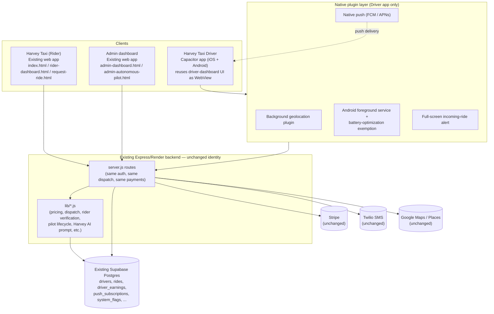

# Harvey Taxi Driver — Mobile App Architecture & Development Plan

Status: **proposal — not approved, no implementation started**
Scope: turns the audited `driver-dashboard.html` web experience into a dedicated
`Harvey Taxi Driver` mobile app, while `Harvey Taxi` (rider-facing) stays a
web app on the current stack. One backend, one database, two clients.

This document does not add or change any code, schema, or API. It is the
plan to review before Phase 1 work starts.

---

## 1. Guiding constraint

Everything below assumes, without exception:

- One Express/Render backend, unchanged in identity (`server.js` + `lib/`).
- One Supabase database — no second project, no read replica fork.
- One auth system, one `drivers` table, one dispatch engine, one payments
  integration (Stripe), one admin dashboard.
- The driver app is a **new client** of the existing APIs, not a new system.
  Where an endpoint doesn't yet serve mobile needs well, it is *extended*
  (new optional field, new platform branch), never forked or duplicated.

Anything in this plan that would require a second backend, a second
database, or copy-pasted business logic is treated as a defect in the plan,
not an acceptable tradeoff.

---

## 2. Phase 1 — Web dashboard improvements (ship first, independent of Phase 2)

These make the current `driver-dashboard.html` better regardless of what
happens in Phase 2, and de-risk Phase 2 by moving logic (navigation
links, SOS, notification payload shape) into the shared backend where the
mobile app can reuse it later instead of reinventing it.

| Item | Change | Notes |
|---|---|---|
| Navigation | Add a "Navigate" action per mission stage that deep-links to `https://www.google.com/maps/dir/?api=1&destination=lat,lng` (falls back to the address string if coordinates are missing) | Client-only change, no backend work |
| SOS / safety | Add a visible SOS control: `tel:911` link plus a `POST /api/driver/safety/alert` call that logs an audit event and pings the admin dashboard/ops channel | New small backend route + one row type in the existing audit log, not a new table |
| Installability | Add `public/manifest.json` (currently linked from `index.html` but doesn't exist on disk) and link it + `apple-mobile-web-app-*` meta tags from `driver-dashboard.html` | Fixes a live dead link as a side effect |
| Push payload | Add `type` and `priority` fields to the JSON body `sendPushNotification()` sends, and add `actions` (Accept/Decline) to the service worker's `showNotification()` call | Backwards compatible — existing web push consumers ignore fields they don't use |
| Real-time state | Replace the 7-second `setInterval` poll in `driver-dashboard.html` with the SSE stream pattern already used for rider live tracking (`server.js:13119`) | Reuses an existing mechanism; removes the biggest source of unnecessary API load |
| UI polish | Bring the mission/offer cards up to the visual standard of `request-ride.html`'s stepper/driver-card work (already shipped for riders) | Cosmetic, no data model change |

None of this requires native code and none of it is wasted if Phase 2
proceeds — the SOS route, the push payload shape, and the SSE stream are
exactly what the mobile app will also call.

---

## 3. Audit recap: what Phase 1 fixes vs. what only Phase 2 can fix

Restating the conclusion from the driver-experience audit, because it's the
whole justification for Phase 2:

- Background GPS while the phone is locked, dependable push that wakes a
  locked screen, and exemption from Android Doze/battery optimization are
  **not achievable from a browser tab or a bare WebView**, no matter how
  much the web app is polished. They require native background-location
  and native push (FCM/APNs) APIs.
- Everything else drivers need — navigation, fast accept/decline, earnings,
  active-trip recovery, camera-based proof, installability — is achievable
  in the current web stack and is handled in Phase 1.

Phase 2 exists specifically to close the background-GPS / locked-screen /
battery-optimization gap. That scopes Phase 2 down to: a client shell +
a small set of native plugins, not a UI reinvention.

---

## 4. Phase 2 — Capacitor vs. React Native

### 4.1 Capacitor

Wraps the existing driver web UI (HTML/CSS/JS, largely reused from
`driver-dashboard.html`) in a native WebView shell, with native plugins
bridged in only for what the browser can't do.

**Pros**
- Reuses ~85-90% of already-shipped, already-tested driver UI code
  (mission cards, offer/accept flow, earnings view, delivery PIN entry,
  photo capture). Directly satisfies the "minimal duplication" requirement.
- One JS/TS codebase for the UI layer; native plugin code is small and
  isolated (background geolocation, FCM receive, foreground service,
  full-screen incoming-ride alert).
- Fastest path to closing the specific gaps identified in the audit.
- Team already knows this codebase's JS/CSS conventions — no new UI
  framework to learn for day-to-day feature work.

**Cons**
- The UI still runs in a WebView, so it has a slightly higher performance
  ceiling cost than fully native views (not usually perceptible for a
  forms-and-lists driver dashboard, but real for heavy animation/maps).
- Native plugin code (Android foreground service, full-screen intent,
  iOS background modes) still has to be written and maintained by someone
  comfortable with Kotlin/Swift — Capacitor doesn't remove that work, it
  just minimizes how much of the *app* needs it.

### 4.2 React Native (or Flutter)

Rewrites the driver UI as native components on top of the existing APIs.

**Pros**
- Best long-term ceiling for native look/feel, animation, and performance.
- Larger ecosystem of mature native modules for exactly this app category
  (ride-hailing driver apps: `react-native-background-geolocation`,
  Firebase messaging, Mapbox/Google Maps native SDKs).
- If Harvey Taxi Driver is expected to become a large, long-lived,
  heavily-invested-in product, this is the ceiling worth building toward.

**Cons**
- Every screen in `driver-dashboard.html` (~2,200 lines of HTML/JS/CSS:
  auth, availability toggle, mission workflow states for both rides and
  deliveries, earnings, saved data, photo proof, delivery PIN flow) gets
  rebuilt from scratch in a new language/framework. That is the opposite
  of "minimal duplication" in the near term — it's a second full
  implementation of the same business rules until it's done.
- Longest time-to-first-value; the background-GPS/locked-screen problem
  (the actual reason this project exists) doesn't get solved any faster
  than the Capacitor path — it needs the same native plugins either way.
- New framework, build pipeline, and release process for the team to own.

### 4.3 Recommendation

**Start with Capacitor.** It reaches every priority in the driver-app
brief (background GPS, locked-screen ride offers, native push, fast
accept/decline, navigation, active-trip recovery, earnings, safety) with
the least duplicated logic and the shortest path to a shippable V1, by
reusing the driver dashboard that Phase 1 will have already improved.

React Native is not "wrong" — it's the better choice if/when Harvey Taxi
Driver has enough scale and roadmap ahead of it to justify a from-scratch
native rebuild for UI polish alone. That's a decision to revisit after V1
ships and usage data exists, not before. Capacitor doesn't box that path
out: the backend/API contract this document defines is exactly what a
future React Native app would also call, so nothing here is thrown away
if that migration happens later.

---

## 5. Target architecture (Capacitor path)

Nothing to the right of "Clients" changes shape — the driver app is a new
box on the left that talks to the same API surface everything else does.

---

## 6. Mobile UI/UX wireframes

Low-fidelity screen wireframes for the driver app's core flows, covering
the priorities in the brief: fast accept/decline, navigation, earnings,
documents, safety. These map directly onto existing `driver-dashboard.html`
sections/state (`state.mission`, `state.driver`, `state.earnings`) so the
Capacitor shell reuses the same data flow, just re-skinned per screen
instead of one long scrolling page.

See the attached wireframe artifact for the visual mockups: **Sign-in →
Home/Availability → Incoming Offer (full-screen) → Active Trip/Navigation
→ Earnings → Documents/Verification → Safety/SOS → Profile.**

---

## 7. Feature roadmap

| Release | Scope |
|---|---|
| **V0 (Phase 1, web)** | Navigation link, SOS route, manifest/installability, actionable push payload shape, SSE instead of polling — ships to the existing web dashboard, all drivers benefit immediately |
| **V1 (Phase 2, mobile)** | Capacitor shell of the driver dashboard; native background geolocation; native push (FCM/APNs) with high-priority ride-offer alerts and a full-screen lock-screen UI; Android foreground service + battery-optimization prompt; native camera for photo proof; existing earnings/history/documents/safety screens ported into the app shell |
| **V1.1** | Native haptics on offer arrival, offline-tolerant accept/decline (queue + retry when connectivity returns), app-store release polish (icons, splash, store listing) |
| **V2 (future, optional)** | Re-evaluate React Native/Flutter rewrite once usage data justifies the investment; native turn-by-turn navigation embedded in-app (vs. deep-linking out to Maps) if driver feedback asks for it |

---

## 8. Backend impact analysis

**No backend rewrite. Additive changes only, all backward compatible with
the existing rider/web clients.**

1. **Push delivery** — `sendPushNotification()` (`server.js:2709`) currently
   only speaks Web Push (VAPID). It gains a platform branch: rows with
   `platform = 'web'` keep using `web-push`; new rows with
   `platform = 'fcm'` go through `firebase-admin` instead. Callers of
   `sendPushNotification()` don't change — same function signature, same
   call sites (`server.js:2795, 8225, 8335, 14090`).
2. **Ride-offer payload shape** — the JSON body sent to push already
   contains `title`/`body`/`url`. It gains `type: "ride_offer"` and
   `priority: "high"` so FCM can flag it as a data/high-priority message
   the OS wakes the device for, and so the app knows to render its own
   full-screen alert instead of a generic banner. Existing web-push
   consumers (the service worker) ignore fields they don't recognize —
   no breaking change.
3. **Safety alert route** — one new endpoint,
   `POST /api/driver/safety/alert`, used by both the improved web
   dashboard (Phase 1) and the mobile app (Phase 2). Writes to the
   existing audit-log mechanism already used elsewhere in the app (the
   same pattern as `logAutonomousPilotEvent`-style audit writes) — no new
   audit system.
4. **Auth session lifetime** — the current driver session token flow
   (email/SMS-verified login → localStorage token) needs a quick check
   for whether tokens are short-lived in a way that assumes "browser tab
   stays open" rather than "app stays installed for weeks." Native apps
   store the same token in Keychain/Keystore via Capacitor's secure
   storage plugin — if the token's expiry model already supports
   long-lived sessions with refresh, no backend change is needed; if not,
   this becomes a small, additive change (a refresh endpoint), not a new
   auth system.
5. **CORS** — no change needed. Native app HTTP requests are not subject
   to browser CORS at all; only the two existing web clients need CORS
   configuration, and neither changes.
6. **Observability (optional, not blocking V1)** — tag location pings and
   offer-accept/decline calls with `client_platform` and `app_version` so
   ops can tell mobile-app traffic from web traffic once both exist.

---

## 9. Database changes

All additive. No existing table is restructured, renamed, or has a column
removed.

1. **`push_subscriptions`** gains a `platform` column
   (`text`, default `'web'`, check constraint `in ('web','fcm','apns')`)
   and the row shape for non-web platforms stores a device token where
   `endpoint`/`p256dh`/`auth` currently go (either reuse `endpoint` as the
   token column with `p256dh`/`auth` nullable for non-web rows, or add a
   nullable `device_token` column — exact shape decided during Phase-1
   implementation, not this planning doc). Existing web-push rows are
   untouched.
2. **Audit log** — the new safety-alert route writes to whatever audit
   table/log pattern the codebase already uses (needs one line to confirm
   the exact existing table name before Phase 1 implementation) — no new
   table if one already exists that fits; a small `driver_safety_alerts`
   table only if the existing audit log doesn't carry enough
   structured fields (location, ride id) for ops to act on it.
3. **Driver documents** — audit finding: there is currently no dedicated
   document-upload table. Identity/background verification already runs
   through Persona and Checkr (external hosted flows, statuses stored as
   columns on `drivers`: `persona_status`, `checkr_status`, etc.), and
   `drivers.photo_url` covers the profile photo. If "Driver documents" in
   the app means more than that (e.g. insurance card, vehicle
   registration image uploaded in-app), that's a **new, scoped feature**
   — a `driver_documents` table (driver_id, document_type, file_url,
   status, reviewed_by, reviewed_at) plus a storage bucket, following the
   same pattern already used for `photo_url`'s bucket. This should be
   confirmed with you before Phase 1 as either in-scope or deferred —
   it's not implied by anything that already exists.
4. **`system_flags`** — reuse the existing feature-flag table (already
   used to gate the rider-history API and the Autonomous Pilot rollout)
   to gate native-push rollout per driver cohort during Phase 2, instead
   of introducing a separate config mechanism.

---

## 10. API changes

| Endpoint | Change | Breaking? |
|---|---|---|
| `POST /api/push/subscribe` | Accepts an optional `platform` + device-token shape alongside the existing web-push subscription shape | No — existing callers unaffected |
| `POST /api/driver/safety/alert` | **New** | N/A |
| `GET /api/driver/:id/missions`, `/earnings`, `/readiness`, `/api/driver/offers/:offerId/accept`\|`/reject`, `/api/driver/location` | No shape change — the mobile app calls these exactly as the web dashboard does today | No |
| Ride-scoped SSE stream (`server.js:13119`) | Reused as-is by both the improved web dashboard (Phase 1) and the mobile app, replacing polling on both | No |

The mobile app is deliberately not getting a parallel "v2" API. It is a new
consumer of the same routes the web dashboard already calls, with two
narrow additions (push platform, safety alert).

---

## 11. Migration plan

There is no data migration in the usual sense — no existing driver data
moves or changes shape. "Migration" here means rolling out the new client
without disrupting drivers currently using the web dashboard.

1. Ship Phase 1 web improvements first; every current driver benefits
   immediately, independent of the mobile app's timeline.
2. Build the Capacitor app against the *current* production API — no
   API changes are required to start Phase 2 client work in parallel with
   the two backend additions (push platform branch, safety route).
3. Add the `platform` column to `push_subscriptions` behind a
   `system_flags` gate; web push behavior is provably unaffected before
   flipping it on for the first mobile test cohort.
4. Closed beta: a small number of real drivers use the mobile app while
   continuing to have the web dashboard available as a fallback (same
   account, same backend — switching between them requires no data
   migration since both read/write the same `drivers`/`rides` rows).
5. Once the beta cohort confirms background GPS, locked-screen offers,
   and battery behavior meet the bar, open enrollment to all drivers;
   the web dashboard can remain available indefinitely as a fallback
   (e.g., for a driver without the app installed) or be sunset later —
   your call once the app has track record.
6. No rider-facing or admin-facing behavior changes at any point in this
   rollout.

---

## 12. Development timeline & estimated effort

| Phase | Work | Estimate |
|---|---|---|
| **Phase 1** | Web dashboard improvements (Section 2) | 1.5–2 weeks |
| **Phase 2.1** | Backend: `push_subscriptions.platform`, FCM branch in `sendPushNotification`, high-priority payload shape, safety-alert route | 3–5 days |
| **Phase 2.2** | Capacitor scaffold; port driver-dashboard screens into app shell; secure-storage session; re-skin per the wireframes (Section 6) | 2–3 weeks |
| **Phase 2.3** | Native plugins: background geolocation, FCM receive + full-screen incoming-ride alert, Android foreground service/battery-optimization prompt, native camera wiring | 2–3 weeks |
| **Phase 2.4** | Closed beta with real drivers, fix findings | 1–2 weeks |
| **Phase 2.5** | App Store / Play Store submission + review buffer | 1–2 weeks |

**Total: roughly 8–12 weeks** end-to-end for one focused engineer from
Phase 1 start through public release, assuming the driver-documents
question in Section 9.3 is resolved (scoped in or explicitly deferred)
before Phase 2.2 begins.

---

## 13. Open decisions needed before Phase 1 starts

1. Is in-app document upload (insurance, registration) in scope for V1,
   or does verification stay entirely on Persona/Checkr + the existing
   profile photo? (Section 9.3)
2. Confirm the existing audit-log table/pattern the safety-alert route
   should write to, so Section 8.3/9.2 doesn't introduce a redundant one.
3. Confirm driver session token expiry behavior, so Section 8.4 either
   closes with "no change" or scopes a refresh endpoint.

Everything else in this document is ready to start on approval.
